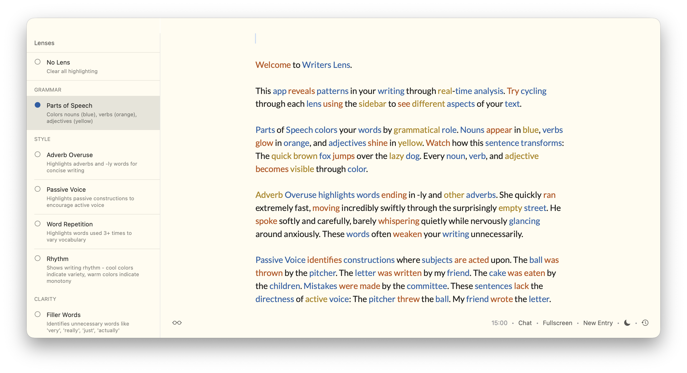

# Writers Lens

A macOS writing analysis app with real-time text highlighting powered by Apple's on-device AI.

Writers Lens helps you improve your writing by revealing patterns through multiple analysis "lenses" - from parts of speech to passive voice to AI-powered show vs. tell detection.



## Features

**8 Writing Lenses:**

- **Parts of Speech** - Colors nouns, verbs, and adjectives to reveal grammatical structure
- **Adverb Overuse** - Highlights -ly words and adverbs that weaken prose
- **Passive Voice** - Identifies passive constructions to encourage active voice
- **Word Repetition** - Shows words used 3+ times to vary vocabulary
- **Rhythm** - Analyzes sentence length patterns using color temperature
- **Filler Words** - Catches unnecessary words like "very", "really", "just"
- **Sentence Length** - Color-codes short, medium, and long sentences
- **Show vs. Tell** (AI-powered) - Finds "telling" statements that could be shown through concrete details

## Requirements

- **macOS 26.0+** (Tahoe) - Required for Foundation Models framework
- **Apple Silicon** - Required for on-device AI features
- **Xcode 26** - Required for building

## Building

```bash
git clone [your-repo-url]
cd writers-lens
open WritersLens.xcodeproj
# Click Run in Xcode
```

Or via command line:

```bash
xcodebuild -scheme WritersLens -configuration Debug build
```

## Architecture

Built with SwiftUI and AppKit using:
- **Natural Language framework** for tokenization and linguistic analysis
- **Foundation Models framework** for AI-powered lenses
- **Custom NSTextView** for attributed text editing with real-time highlights
- **Lens-based analysis system** for modular writing pattern detection

See `CLAUDE.md` for detailed architecture documentation.

## Credits

Forked from the original [Freewrite app](https://github.com/farzaa/freewrite) by Farza.

## License

Open source - remix and build as you like.
